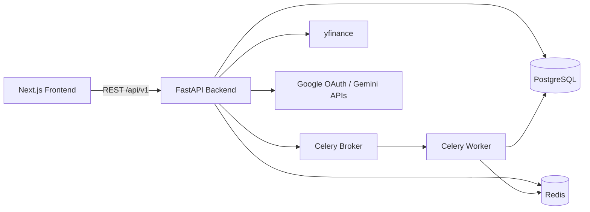

# EcoQuant

[English](README.md) | 한국어

<p align="left">
  
  
  
  
  
  
</p>

전략 관리부터 백테스트, 비동기 실행, AI 시그널 분석까지 포함한 퀀트 트레이딩 플랫폼입니다.

- 전략 생성/관리 및 백테스트
- JWT + Google OAuth 인증
- Celery 기반 비동기 작업 처리
- AI 감성 분석(Gemini) + 기술적 지표 결합
- Next.js 기반 대시보드 UI

## 목차
- [아키텍처](#아키텍처)
- [핵심 기능](#핵심-기능)
- [기술 스택](#기술-스택)
- [저장소 구조](#저장소-구조)
- [빠른 시작](#빠른-시작)
- [API 요약](#api-요약)
- [운영 메모](#운영-메모)

## 아키텍처



## 핵심 기능

- 인증/보안
  - 이메일/비밀번호 로그인 + JWT Access/Refresh
  - Google OAuth 로그인 연동
  - bcrypt 비밀번호 해싱
- 전략 라이프사이클 관리
  - 전략 생성, 수정, 복제, 보관, 삭제
  - SMA/EMA/RSI/MACD/Bollinger/Momentum/DCA/Sentiment 계열 지원
- 비동기 백테스트
  - Celery 큐 기반 실행
  - 상태 조회, 취소, 히스토리, 비교 기능
  - 수익률/샤프/낙폭 등 성과 지표 저장
- AI + 시장 분석
  - 기술적 분석 + 뉴스 감성 분석 결합 실시간 시그널
  - 뉴스 수집 및 감성 점수 파이프라인
- 운영 기본기
  - Health / Readiness 엔드포인트 제공
  - 환경변수 기반 설정 관리
  - Docker 기반 인프라(PostgreSQL/Redis/Celery/Flower)

## 기술 스택

| 계층 | 기술 |
|---|---|
| Frontend | Next.js 16, React 19, TypeScript, TanStack Query, Axios, Tailwind CSS 4, Radix UI |
| Backend API | FastAPI, SQLAlchemy 2.0 (async), Pydantic v2, Alembic |
| Quant Engine | Backtrader, pandas, NumPy, yfinance, TA-Lib |
| Async Processing | Celery, Redis, Flower |
| Data Layer | PostgreSQL 16, Redis 7 |
| AI/External | Google Gemini API, Google OAuth |

## 저장소 구조

```text
quant_platform/
  backend/
    app/
      api/v1/endpoints/     # auth, strategies, backtest, analysis
      core/                 # config, database, security, exceptions
      engine/               # backtest runner + strategy implementations
      models/               # SQLAlchemy models
      schemas/              # Pydantic request/response schemas
      services/             # AI/news services
      worker.py             # Celery app + tasks
    alembic/                # DB migrations
    docker-compose.yml      # postgres, redis, celery_worker, celery_beat, flower
    env.example             # 안전한 환경변수 템플릿
  frontend/
    src/app/                # Next.js App Router 페이지
    src/lib/api.ts          # API client (/api/v1)
```

## 빠른 시작

### 1) 사전 준비

- Python 3.11+
- Node.js 20+ 및 npm
- Docker Desktop (PostgreSQL/Redis/Celery 실행용)

### 2) 백엔드 실행

```bash
cd backend
cp env.example .env
pip install -r requirements.txt
docker compose up -d postgres redis
alembic upgrade head
uvicorn app.main:app --reload --host 0.0.0.0 --port 8000
```

백엔드 문서/헬스체크:
- Swagger: `http://localhost:8000/docs`
- Health: `http://localhost:8000/health`

워커 실행(별도 터미널):

```bash
cd backend
celery -A app.worker worker --loglevel=info --concurrency=4
```

모니터링(선택):

```bash
cd backend
docker compose up -d flower
```

Flower UI: `http://localhost:5555`

### 3) 프론트엔드 실행

```bash
cd frontend
npm install
```

`frontend/.env` 생성:

```bash
NEXT_PUBLIC_API_URL=http://localhost:8000
```

실행:

```bash
npm run dev
```

웹 UI: `http://localhost:3000`

## API 요약

Base URL: `http://localhost:8000/api/v1`

| 도메인 | 주요 엔드포인트 |
|---|---|
| Auth | `POST /auth/register`, `POST /auth/login`, `POST /auth/refresh`, `GET /auth/me`, `GET /auth/google`, `POST /auth/google/callback` |
| Strategies | `POST /strategies`, `GET /strategies`, `GET /strategies/{id}`, `PATCH /strategies/{id}`, `DELETE /strategies/{id}`, `POST /strategies/{id}/duplicate` |
| Backtest | `POST /backtest/run`, `GET /backtest/{id}/status`, `GET /backtest/{id}`, `GET /backtest`, `POST /backtest/compare`, `POST /backtest/{id}/cancel` |
| Analysis | `POST /analysis/live_signal`, `GET /analysis/market/{ticker}` |

## 운영 메모

- 시크릿 관리
  - `.env` 파일은 절대 커밋하지 않습니다.
  - `env.example` 같은 템플릿만 커밋합니다.
  - 시크릿 노출 시 즉시 폐기/재발급 후 Git 히스토리 정리를 수행합니다.
- Push Protection
  - GitHub Secret Scanning 규칙이 적용되어 있습니다.
  - `.gitignore`를 나중에 고쳐도 히스토리에 시크릿이 있으면 push가 거부됩니다.
- 개발 품질 점검

```bash
# backend
cd backend
pytest

# frontend
cd frontend
npm run lint
npm run build
```
