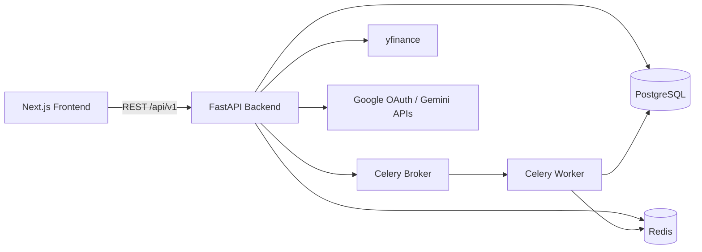

# EcoQuant

English | [한국어](README.ko.md)

<p align="left">
  
  
  
  
  
  
</p>

Production-style quantitative trading platform with:
- Strategy management and backtesting
- JWT + Google OAuth authentication
- Async task processing with Celery
- AI-enhanced market signal analysis (Gemini + technicals)
- Modern dashboard UI (Next.js App Router)

## Table of Contents
- [Architecture](#architecture)
- [Core Features](#core-features)
- [Tech Stack](#tech-stack)
- [Repository Structure](#repository-structure)
- [Quick Start](#quick-start)
- [API Surface](#api-surface)
- [Operational Notes](#operational-notes)

## Architecture



## Core Features

- Authentication and security
  - Email/password auth with JWT access/refresh tokens
  - Google OAuth login flow
  - Password hashing with bcrypt
- Strategy lifecycle management
  - Create, update, duplicate, archive, and delete strategies
  - Supports multiple strategy types (SMA/EMA/RSI/MACD/Bollinger/Momentum/DCA/Sentiment hybrids)
- Asynchronous backtesting
  - Queue-based execution via Celery
  - Status polling, cancelation, history, and comparison endpoints
  - Persisted performance metrics and equity curves
- AI + market analysis
  - Live signal generation using technical indicators and sentiment signals
  - News collection and sentiment scoring pipeline
- Reliability basics
  - Health and readiness endpoints
  - Structured configuration via environment variables
  - Dockerized infrastructure services (PostgreSQL/Redis/Celery/Flower)

## Tech Stack

| Layer | Technologies |
|---|---|
| Frontend | Next.js 16, React 19, TypeScript, TanStack Query, Axios, Tailwind CSS 4, Radix UI |
| Backend API | FastAPI, SQLAlchemy 2.0 (async), Pydantic v2, Alembic |
| Quant Engine | Backtrader, pandas, NumPy, yfinance, TA-Lib |
| Async Processing | Celery, Redis, Flower |
| Data Layer | PostgreSQL 16, Redis 7 |
| AI/External | Google Gemini API, Google OAuth |

## Repository Structure

```text
quant_platform/
  backend/
    app/
      api/v1/endpoints/     # auth, strategies, backtest, analysis
      core/                 # config, database, security, exceptions
      engine/               # backtest runner + strategy implementations
      models/               # SQLAlchemy models
      schemas/              # Pydantic request/response schemas
      services/             # AI/news services
      worker.py             # Celery app + tasks
    alembic/                # DB migrations
    docker-compose.yml      # postgres, redis, celery_worker, celery_beat, flower
    env.example             # safe env template
  frontend/
    src/app/                # Next.js App Router pages
    src/lib/api.ts          # API client (/api/v1)
```

## Quick Start

### 1) Prerequisites

- Python 3.11+
- Node.js 20+ and npm
- Docker Desktop (for PostgreSQL/Redis/Celery services)

### 2) Backend Setup

```bash
cd backend
cp env.example .env
pip install -r requirements.txt
docker compose up -d postgres redis
alembic upgrade head
uvicorn app.main:app --reload --host 0.0.0.0 --port 8000
```

Backend docs:
- Swagger: `http://localhost:8000/docs`
- Health: `http://localhost:8000/health`

Run worker (separate shell):

```bash
cd backend
celery -A app.worker worker --loglevel=info --concurrency=4
```

Optional monitoring:

```bash
cd backend
docker compose up -d flower
```

Flower UI: `http://localhost:5555`

### 3) Frontend Setup

```bash
cd frontend
npm install
```

Create `.env` in `frontend/`:

```bash
NEXT_PUBLIC_API_URL=http://localhost:8000
```

Run frontend:

```bash
npm run dev
```

UI URL: `http://localhost:3000`

## API Surface

Base URL: `http://localhost:8000/api/v1`

| Domain | Key Endpoints |
|---|---|
| Auth | `POST /auth/register`, `POST /auth/login`, `POST /auth/refresh`, `GET /auth/me`, `GET /auth/google`, `POST /auth/google/callback` |
| Strategies | `POST /strategies`, `GET /strategies`, `GET /strategies/{id}`, `PATCH /strategies/{id}`, `DELETE /strategies/{id}`, `POST /strategies/{id}/duplicate` |
| Backtest | `POST /backtest/run`, `GET /backtest/{id}/status`, `GET /backtest/{id}`, `GET /backtest`, `POST /backtest/compare`, `POST /backtest/{id}/cancel` |
| Analysis | `POST /analysis/live_signal`, `GET /analysis/market/{ticker}` |

## Operational Notes

- Secret hygiene
  - Never commit `.env` files.
  - Commit only templates such as `env.example`.
  - If a secret is exposed, rotate it immediately and rewrite Git history before pushing.
- Push protection
  - This repository is protected by GitHub secret scanning rules.
  - A push is rejected if commit history contains leaked credentials, even if `.gitignore` is now correct.
- Development quality checks

```bash
# backend
cd backend
pytest

# frontend
cd frontend
npm run lint
npm run build
```
